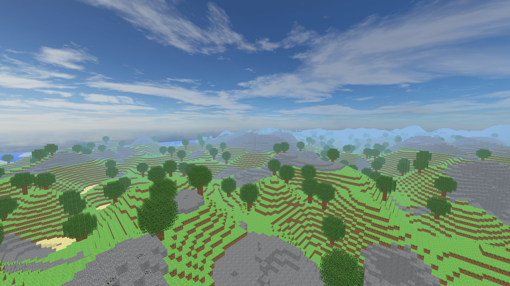
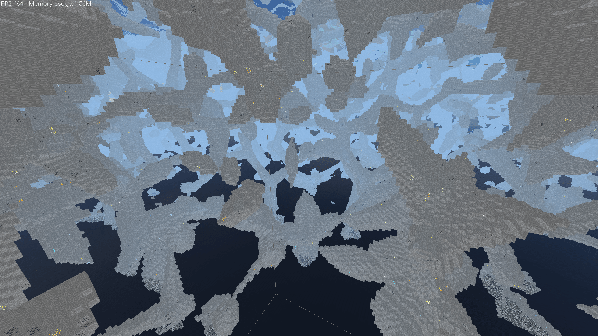
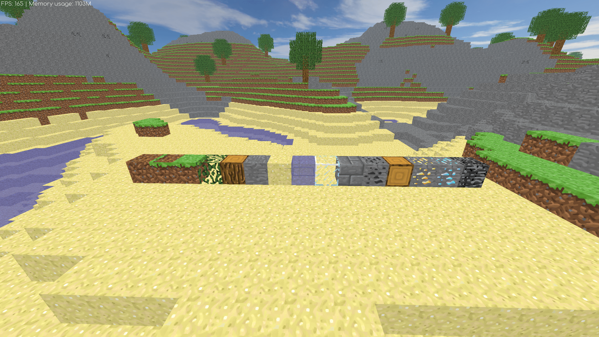

<h1>FT_VOX</h1> 
 

<h2>Description</h2>
Welcome to the beautiful world of voxels, where you will use all the benefits of the 
abstraction "the whole world is a 3 dimensions grid" in order to display a daunting number 
of things on a screen, travel in a gigantic procedural universe and a completely malleable 
playground. What are voxels? 
 
This project aims to confront you to a graphic project that will be extremely demanding 
in terms of optimization. You will have to study the characteristics of the voxel worlds, 
and use them along your infographics knowledge to display a lot of elements on screen. 
Thus, you will have to study different algo/opti to obtain a SMOOTH render (there are 
many of them). You will also have to manage your memory and data structures properly 
to be able to travel in a very, very large universe.  
 

<h2>Installation</h2> 
 

Requirements: `OpenGL version >= 4.0`. 

You must install the following dependencies : `freeglut 2.8.1`, `freetype-2.10.0`, `glew 2.2.0`, `glm 0.9.9.8` and `irrKlang-64bit-1.6.0`. 

 

On Linux you can use: 
`make install_libs` 
`. ./set_libs_paths.sh` 
`make` or `make fast` to compile with multiple threads. 
 

If you have the error "fatal error: GL/glu.h: No such file or directory" while installing the libs, you must install the package `libglu1-mesa-dev`. 

You can now run ft_vox. :)
 

<h2>Parameters</h2> 

`-f or --fullscreen :` Fullscreen mode. 
`-w or --width <int> :` Specify the window width. (min: 320, max: 15360)  
`-h or --height <int> :` Specify the window height. (min: 240, max: 8460) 
`-ws or --world-size <int> :` Set the data structure world size, must be a multiple of 8. (min: 8, max: 128, default 64) 
`-s or --seed <int> :` Set the seed world. (default 42) 
`-d :` Debug mode 
`--sync :` Disable vsync 
`-v or --version <int> :` Specify shaders version. The right version to give is at your discretion. (min 100, max: 999, default: 460) 

<h2>Controls</h2> 

`ZQSD/WASD` to move around, `A` to go up, `E` to go down and `shift` to go fast. 
`home` and `end` to go to two predetermined positions. 
`PageUp` and `PageDown` to up/down the sound volume. 
`left mouse button` to build a block. 
`right mouse button` to remove a block. 
`scrollwheel` to select different types of blocks. 
`KP_+` and `KP_-` to change player speed. 
`insert` to toggle anchor camera. 
`F1` to change sampling value. 
`F2` to toggle anti-aliasing. 
`F3` to toggle transparency. 
`F4` to toggle collision. 
`F5` to toggle focussing on transparent blocks. 
`F6` to change the framerate limit. 
`F7` to change the render distance limit. 
`F8` to swap the both worlds. 
`F9` to show debug info. 
`F10` to desactivate infinite world. 
`F11` to activate autowalk. 

<h2>Screenshots</h2>
<h3>World:</h3>

 

<h3>Cave:</h3>

<h3>Blocks:</h3>

<h2>Grade</h2>

`125/100`